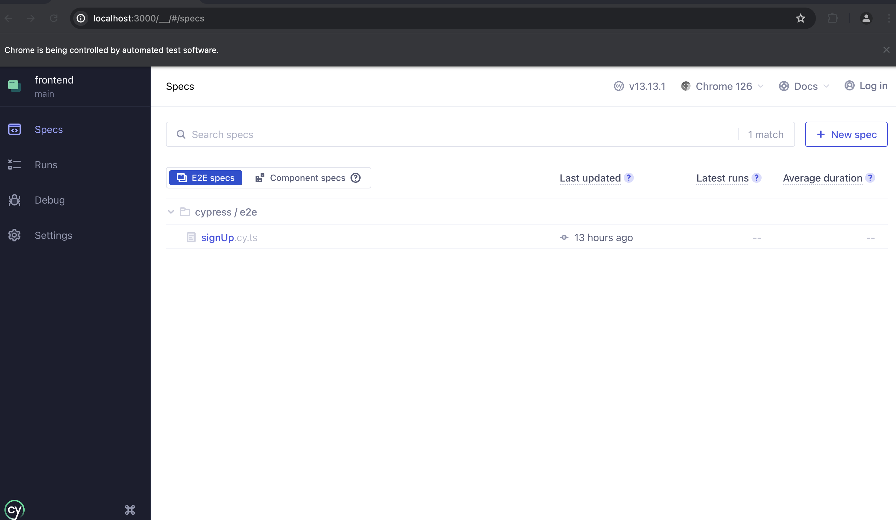

<div align="center">
  

</div>

<h2 align="center">
   Agidesk SignUp Flow
</h2>

<p align="center">

  

  

  
  

  

</p>

<hr/>

<h3 align="center">Links:</h3>

<p align="center">

  <a href="#-sobre-esse-projeto">
    Sobre o projeto
  </a>&nbsp;&nbsp;
  <a href="#-frontend">
    Frontend
  </a>&nbsp;&nbsp;
  <a href="#-funcionalidades">
    Funcionalidades
  </a>&nbsp;&nbsp;
  <a href="#-requisitos">
    Requisitos
  </a>&nbsp;&nbsp;
  <a href="#-executando-o-projeto">
    Executando o projeto
  </a>&nbsp;&nbsp;
  <a href="#-tecnologias-e-ferramentas">
    Tecnologias e Ferramentas
  </a>&nbsp;&nbsp;
  <a href="#-roadmap">
    Roadmap
  </a>&nbsp;&nbsp;
  <a href="#author-frederico-reis">
    Author
  </a>

</p>

# 💡 Sobre esse projeto

A proposta desse projeto era construir uma aplicação fullstack que permitisse ao usuário se cadastrar e receber um email de confirmação para e autenticação.

Caso queira acessar o repositório com o projeto backend acesse o link a seguir:  
 [📑 Repositório Backend](https://github.com/Fred-Reis/agi-be-challenge/?tab=readme)

<br/>

# 🖥 Frontend

O objetivo do frontend desse projeto era criar um formulário de cadastro de um novo usuário e consequentemente da sua empresa, e enviar um email para o endereço cadastrado, permitindo que o mesmo tivesse acesso a uma experiência de avaliação na plataforma.


<br/>

# 🔥 Funcionalidades

O fluxo de cadastro segue 5 etapas que coletam os dados do usuário e da empresa, permitindo uma experiência de avaliação personalizada na plataforma da Agidesk.

<br/>

# 📣 Requisitos

Nesse cadastro existem poucos requisitos para permitir o cadastro do usuário:

- O usuário precisa utilizar um endereço de e-mail corporativo.
    - Para garantir essa validação, é feito uma reuisição para nossa api com a lista dos provedores não permitidos para o cadastro.
- Todos os campos são obrigatórios, exceto a cor que pode ser alterada futuramente pela plataforma.

<br/>

## 👀 Demo

<h1 align="center">
  
</h1>

<br/>

# 🏁 Executando o projeto

<br/>

> **🚨 Antes de executar o projeto é necessário que o [backend]((https://github.com/Fred-Reis/agi-be-challenge/?tab=readme)) esteja configurado e rodando!! 📣**

<br/>

1 - Para rodar pela primeira vez o seu projeto será necessário a criação de uma pasta.

```bash
$ mkdir <nome-da-pasta>
```

2 - Agora entre na pasta criada.

```bash
$ cd <nome-da-pasta>
```

3 - Vamos clonar o repositório

```bash
$ git clone https://github.com/Fred-Reis/agi-fe-challenge
```

4 - Execute o comando a seguir para a criação da pasta `node_modules`

```bash
$ npm install
```

5 - Para iniciar o projeto execute o seguinte comando

```bash
$ npm run dev
```
<br/>

<p align="center">
Se você chegou até até aqui significa que tudo correu bem 🙏🏼 então você será capaz de acessar o fomulário no seu browser 😱 através da seguinte URL:

`http://localhost:3000`
<p>

<br/>

## 🧪 Testes

Nessa aplicação foram implentados testes (cobertura parcial) de integração (E2E) usando [Cypress](https://www.cypress.io/).

Nesse teste foi coberto todo o fluxo de cadastro do usuário

> **🚨 Apenas lembrando que para executar os testes o [backend]((https://github.com/Fred-Reis/agi-be-challenge/?tab=readme)) do projeto deve estar rodando!! 📣**  

Para rodar o teste execute os comandos a seguir na raiz do projeto frontend:

```bash
$ npx cypress open
```

Em seguida uma janela deve abrir com o dashboard do cypress, escolha a opção de `E2E` e o seu browser de preferência
na janela a seguir escolha o `signUp.cy.ts` e em seguida voce verá a aplicação sendo executada. 



<br/>

# 🛠 Tecnologias e Ferramentas

Algumas das tecnologias e ferramentas utilizadas no backend.

- [**Nestjs 14**](https://nextjs.org/);
- [Tailwind](https://tailwindcss.com/);
- [React Hook Form](https://react-hook-form.com/);
- [Zod](https://zod.dev/);
- [Cypress](https://www.cypress.io/)
- [Prisma](https://prisma.io/);
- [JWT](https://jwt.io/);
- EsLint;

<br/>

# 📍🗺️ Roadmap

Algumas das funcionalidades que devem ser implementadas em breve

- [ ] Internacionalização com [i18n](https://www.i18next.com/)
- [ ] Permitir que o usuário insira sua cor personalizada para customizar a plataforma
- [ ] Implementar login social com Gmail e Outlook.
- [ ] Hospedar os assets em um servidor CDN para reduzir o tamanho do bundle da aplicação
- [ ] Implementar validações e exibição de erros
- [ ] Fazer o deployda aplicação

<hr/>
<br/>


<h4 align="center">
  😃 Agora rode o projeto e ... SEJA FELIZ!
</h4>

<h4 align="center">
  "Stay hungry stay foolish!"
</h4>

<br/>

---

<h3 align="center">
Author: <a alt="Fred-Reis" href="https://github.com/Fred-Reis">Frederico Reis</a>
</h3>

<p align="center">

  <a alt="Frederico Reis" href="https://www.linkedin.com/in/frederico-reis-dev/">
    </a>
  <a alt="Frederico Reis" href="https://github.com/Fred-Reis ">
  </a>

</p>

<p align="center">
  Feito com ♥️
</p>

